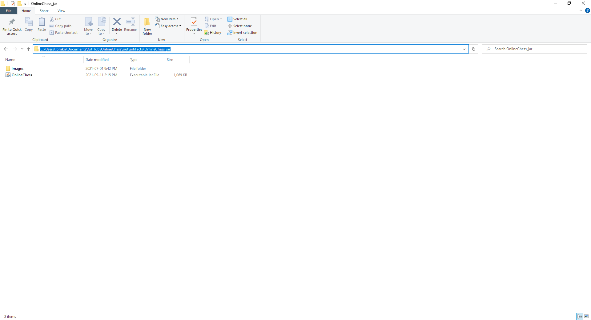

This is my Chess project that I've made entirely in Java. If you would like a video explanation of the project: https://www.youtube.com/watch?v=aEC3SoSilM4. This Chess project has all the normal chess rules and functions, however, it is missing en passen and promotion to other than queen (you can still promote to queen, just not to anything else). You also have the ability to play with a friend, given that both you and your friend have a stable internet connection. To download this project, you first need to have Java 15.0.2 or above. To check what version of Java you have, open CMD and type in exactly "java -version". Here is the Java website to download the latest version of Java https://www.oracle.com/java/technologies/javase-jdk16-downloads.html To download this project 
1. Click on code
2. Download zip
3. Open the folder where you downloaded the zip (typically your downloads folder)
4. Right click on the zip
5. Click extract here
6. Open the folder 
7. Go to "out" --> "artifacts" --> "OnlneChess_jar" 
If everything is done correctly, you should see something like this:
 
8.Here, your going to want to want to click on the address bar, and type in CMD:
 
If everything is done correctly, you should see something like this:
 
9. In CMD, exactly type in:java -jar OnlineChess.jar
10. It will then ask if you are the client or the server, if you are play alone type in server. If you are playing alone please see below You should see a chessboard pop up, with white facing you.
11. If you are playing alone, repeat steps 7-9, such that it asks if you are the client or the server
12. Instead of typing server, type client
13. Since you are playing alone, you don't need to type in an ipv4 adress. Type in "localhost" At this point, you should be able to play by yourself. 

IF YOU ARE PLAYING WITH A FRIEND
(NOTE: If you are playing with a friend, please be advised that your friend will easily be able to accsess your network, and if given the right tools and skills, be able to accsess your location. Please be advised.) 
Both you and you will friend will have to go to this website and download LogMeInHamachi: https://vpn.net/
If you and your friend have downlaoded it correctly, you should see something like this:

One of you will need to create a network, and the other will have to join.
For the person who is creating the network:
1. Press create a network, if that option dose not appear for you, click on network on the top, and click create new network
2. Enter a network ID and password, this does not matter, it can be anything.
3. Create network

For the person who is joining a network.
1. Click on join network
2. Enter the ID and Password

Now you two should be on the same network. To test if everything is working fine, please ping the other person by right clicking their name and clicking ping. If you do not get a response, it is highly likely that windows firewall is block hamachi. Please disable your firewall for Hamachi. 
Both players will follow steps 1-9 that I listed above
10. One of you, the server, will have to give their IPV4 address to the other player. If you do not know your IPV4 adress, type in cmd in your taskbar to open it. Type in "ipconfig", and press enter. You should see a line that describes your IPV4 adress. 
11. The server, (the one that has given their ipv4 adress), will type in server in to the command prompt.

*IMPORTANT* It is important that the server launches first, as the client connects to the server
It will then be waiting for the client to connect.

12. The other person will type in client. 
13. Here, it will ask you to connect to the server by typing in the IPV4 adress of the server. Please type in the IPV4 adress here

At this point both of you will be connnected and playing. Remember White goes first

Some Screenshots:

